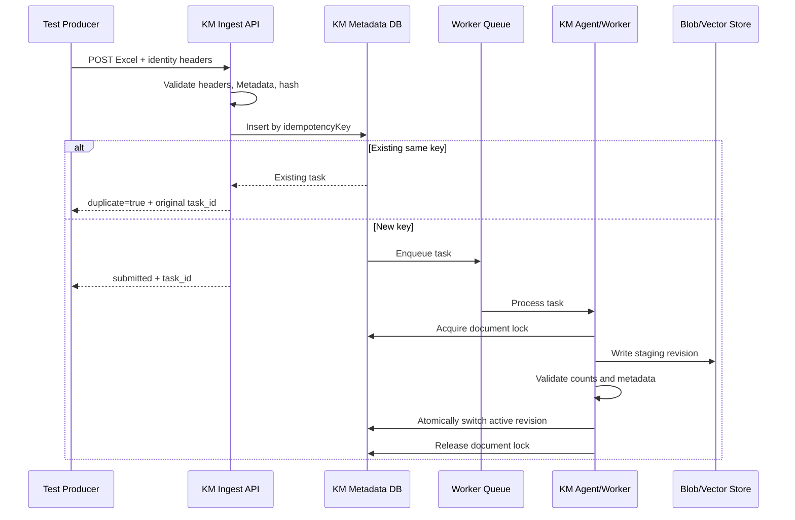

# KM Agent 跨測試環境防衝突協作規格

版本：v1.0
適用日期：2026-08-03
適用來源：Anritsu、Amarisoft，以及未來其他測試環境

## 1. 文件目的

本文件定義測試端與 KM Agent／KM ingestion backend 之間的檔案識別、去重、併發、重試、版本與查詢規則。

目標如下：

1. Anritsu 與 Amarisoft 可以同時產生及上傳 Excel，不互相覆蓋。
2. 同一份檔案因網路重試或程序重啟而重送時，不會重複攝入。
3. 同一個專案可以保留多次測試歷史，不因相同 Excel 檔名而誤判為同一筆資料。
4. 同一個 `runId` 若出現不同內容，必須被辨識為衝突，不可靜默覆蓋。
5. KM Agent 查詢時能區分來源環境、專案、批次與測試時間。

本規格是雙方的資料契約。測試端與 KM 端都必須遵循相同欄位與判定規則，不得各自重新定義去重鍵。

## 2. 核心原則

### 2.1 檔名不是唯一識別

使用者指定的 Excel 檔名，例如：

```text
SIT-TR-NR-Throughput-NCQ1230-EV-V10.xlsx
```

只是人員閱讀用的專案／報告名稱，不得單獨作為去重鍵、覆蓋鍵、KM logical document 的唯一鍵或最新版本判定依據。

### 2.2 `runId` 是單次執行的追蹤識別

每次單次或批次測試都必須產生新的唯一 `runId`。同一專案再次測試時，不能重用舊的 `runId`。

### 2.3 來源與環境必須隔離

`sourceSystem` 用來識別測試系統種類，`environmentId` 用來識別實驗室、機台或執行環境。

```text
sourceSystem:  anritsu
environmentId: anritsu-lab-a

sourceSystem:  amarisoft
environmentId: amarisoft-lab-a
```

即使兩個環境使用相同專案名稱、相同檔名、相同 band 組合，也不得互相覆蓋。

### 2.4 內容雜湊是檔案內容完整性依據

測試端上傳前必須計算正式 Excel 的 SHA-256：

```text
sourceFileHash = SHA-256(formal Excel bytes)
ingestFileHash = SHA-256(KM ingest Excel bytes)
```

KM 端必須驗證收到的檔案 hash 與 metadata 中的 hash 一致，不能只相信檔名或 multipart 欄位。

## 3. 必要識別欄位

每一個 Excel artifact 都必須具有下列欄位：

| 欄位 | 必填 | 說明 |
|---|---:|---|
| `sourceSystem` | 是 | `anritsu`、`amarisoft` 等來源系統 |
| `environmentId` | 是 | 穩定的測試環境或機台識別 |
| `projectId` | 是 | 專案／報告名稱 |
| `runId` | 是 | 該次測試唯一識別 |
| `artifactType` | 是 | `single` 或 `batch` |
| `reportSchema` | 是 | 例如 `ota-throughput-v1` |
| `originalFileName` | 是 | 使用者要求的原始 Excel 檔名 |
| `sourceFileHash` | 是 | 正式 Excel 的 SHA-256 |
| `ingestFileHash` | 是 | 加入 `KM_Metadata` 後上傳副本的 SHA-256 |
| `documentId` | 是 | KM 邏輯文件識別 |
| `idempotencyKey` | 是 | 重送／去重識別 |
| `generatedAt` | 是 | 報告產生時間，ISO-8601 |

## 4. 識別鍵產生規則

### 4.1 `documentId`

目前測試端使用：

```text
<extractionMode>:<sourceSystem>:<environmentId>:<runId>:<artifactType>
```

範例：

```text
4g5g:anritsu:anritsu-lab-a:multicombo-20260803-101522-ab12cd34:batch
```

要求：

- 必須唯一且穩定。
- 同一個 `documentId` 只能代表同一個測試執行 artifact。
- 不得以原始檔名作為唯一區分依據。
- 不同 `sourceSystem`、`environmentId`、`runId` 或 `artifactType` 必須產生不同 `documentId`。

### 4.2 `idempotencyKey`

目前測試端使用下列欄位串接後計算 SHA-256：

```text
sourceSystem
environmentId
runId
artifactType
sourceFileHash
```

```text
idempotencyKey = SHA-256(
  sourceSystem + "\n" +
  environmentId + "\n" +
  runId + "\n" +
  artifactType + "\n" +
  sourceFileHash
)
```

KM 端必須以 `idempotencyKey` 作為相同提交的冪等判斷依據，並對其建立唯一約束。

### 4.3 不可使用的去重方式

KM Agent 不得使用以下任一項作為唯一去重鍵：

- `originalFileName`
- `projectId`
- band 組合文字
- Excel 檔案大小
- 自然語言查詢字串
- 只有日期而沒有 `runId` 的時間欄位

## 5. 上傳協定

測試端使用：

```http
POST /api/upload/ingest?extraction_mode=4g5g
Content-Type: multipart/form-data
```

必要 HTTP headers：

```text
Authorization: Bearer <token>
Idempotency-Key: <idempotencyKey>
X-KB-Source-System: <sourceSystem>
X-KB-Environment-Id: <environmentId>
X-KB-Run-Id: <runId>
X-KB-Artifact-Type: <artifactType>
X-KB-Document-Id: <documentId>
```

Excel 的 `KM_Metadata` 工作表至少應包含第 3 節的必要欄位。HTTP headers 與 `KM_Metadata` 不一致時，KM 必須拒絕請求，不可選擇其中一份資料靜默繼續。

成功提交的建議回應：

```json
{
  "status": "submitted",
  "task_id": "ingest_20260803_101522_ab12cd34",
  "document_id": "4g5g:anritsu:anritsu-lab-a:multicombo-20260803-101522-ab12cd34:batch",
  "idempotency_key": "sha256...",
  "file_hash": "sha256...",
  "duplicate": false
}
```

## 6. 衝突與重送判定矩陣

| 情境 | 判定 | KM 必須行為 | 建議回應 |
|---|---|---|---|
| 不同環境、相同專案與檔名 | 不衝突 | 建立各自文件 | `202 submitted` |
| 同環境、不同 `runId` | 不衝突 | 保留為不同歷史測試 | `202 submitted` |
| 同 `documentId`、同 `idempotencyKey` | 重送同一 artifact | 不建立新 task，回傳既有 task | `duplicate=true` |
| 同 `documentId`、不同 `idempotencyKey` | 內容衝突 | 拒絕，禁止覆蓋既有 artifact | `409 conflict` |
| 同 `idempotencyKey`、請求重試 | 冪等重送 | 回傳原 task 狀態 | `duplicate=true` |
| 同檔名但不同 `sourceSystem` | 不衝突 | 依來源隔離 | `202 submitted` |
| 缺少 `runId` 或 `documentId` | 無法追蹤 | 拒絕 | `422 validation_error` |
| headers 與 `KM_Metadata` 不一致 | 身分不可信 | 拒絕並記錄 audit | `422 metadata_mismatch` |
| hash 不符合實際檔案 | 檔案遭變更 | 拒絕，不進入 worker | `422 hash_mismatch` |
| 同一文件同時兩個 worker 攝入 | 併發衝突 | 只允許一個持有 document lock | `409` 或既有 task 狀態 |

## 7. KM 後端資料庫約束

### 7.1 `ingestion_requests`

至少建立：

```text
UNIQUE(idempotency_key)
UNIQUE(task_id)
NOT NULL(document_id, source_system, environment_id, run_id,
        artifact_type, file_hash, status)
```

建議保存：

```text
id
idempotency_key
document_id
source_system
environment_id
project_id
run_id
artifact_type
report_schema
original_file_name
source_file_hash
ingest_file_hash
task_id
status
duplicate_of_task_id
created_at
updated_at
```

### 7.2 `logical_documents`

```text
UNIQUE(document_id)
```

`logical_documents` 代表一個 `documentId`。不同 `runId` 會產生不同 logical document；同一 `documentId` 的新內容只能透過明確的 revision policy 處理，不能直接覆蓋 active revision。

### 7.3 Blob／檔案儲存

Blob 儲存可以使用 `file_hash` 去重實體內容，但不能因此刪除或合併不同 `documentId` 的測試紀錄。實體檔案可以共用，測試 metadata 與 logical document 仍要分開保存。

## 8. 併發鎖與工作流程

### 8.1 提交層鎖

以 `idempotencyKey` 建立短時間 Redis lock 或資料庫唯一插入保護：

```text
ingest:idempotency:<idempotencyKey>
```

若已存在，查詢原始 `task_id`，不建立第二個 worker task，回傳 `duplicate=true` 與原 task 狀態。

### 8.2 文件攝入層鎖

worker 寫入同一個 logical document 時，使用：

```text
ingest:document-lock:<documentId>
```

鎖必須具備 owner token、TTL、compare-and-delete release，並能在 worker crash 後過期回收。lock busy 時不可刪除其他 worker 的資料。

### 8.3 建議 worker 流程



## 9. 測試端重試規則

1. 有 `task_id`：只 polling 原 task，不重新上傳。
2. `task_id` 遺失但本地 state 存在：標記 `retry-pending`，等待人工或明確 retry。
3. 只有在使用者明確要求重新提交時，才允許建立新的提交嘗試。
4. 重新提交時不得重用不同內容的舊 `documentId`。
5. 任何 409 conflict 都必須保留原始 state、錯誤內容與 audit，不得自動改檔名後再次上傳來掩蓋衝突。

KM Agent 重新啟動後，也應先從 `task_id` 恢復 polling，而不是依檔名重新建立任務。

## 10. 版本與 active revision

同一專案的多次測試屬於不同 `runId`，建議在 KM 中以以下階層保存：

```text
projectId
  └── sourceSystem
      └── environmentId
          └── runId
              └── artifactType
                  └── revision
```

規則：

- 不同 `runId`：建立不同測試紀錄。
- 相同 `runId`、相同 hash：視為同一次測試的重送。
- 相同 `runId`、不同 hash：視為衝突，禁止靜默更新。
- 若業務需要修正版：必須明確產生 `revision`，保存 `revisionReason`、操作者、時間與原始版本。
- 原始版本不可刪除，只能標記 inactive 或 superseded。

## 11. 查詢行為規格

使用者查詢專案名稱，例如：

```text
查詢 NCQ1230 專案的測試資訊
```

KM Agent 不應只依檔名直接回傳一筆資料。建議流程：

1. 將關鍵字解析為 `projectId` 或 project keyword。
2. 若沒有指定來源，先分組顯示 `sourceSystem` 與 `environmentId`。
3. 依 `runId`／`generatedAt` 找出最新完成結果。
4. 預設回傳最新一筆摘要與歷史筆數。
5. 使用者要求「全部歷史」時，才列出每個 `runId`。
6. 不得把 Anritsu 與 Amarisoft 的同名專案結果無標示合併。
7. 結果必須包含 `projectId`、`sourceSystem`、`environmentId`、`runId`、`artifactType`、`status` 與 `generatedAt`。

建議查詢條件：

```json
{
  "query": "NCQ1230",
  "filters": {
    "sourceSystem": ["anritsu"],
    "environmentId": ["anritsu-lab-a"],
    "projectId": ["SIT-TR-NR-Throughput-NCQ1230-EV-V10"],
    "artifactType": ["batch"],
    "status": ["completed"]
  },
  "sort": [{"field": "generatedAt", "order": "desc"}],
  "limit": 20
}
```

## 12. 回應狀態與使用者訊息

| 技術狀態 | 使用者訊息 |
|---|---|
| `submitted` | 已送出 KM 攝入任務，等待處理 |
| `processing` | KM 正在攝入，顯示 taskId 與進度 |
| `completed` | Excel 已成功攝入 KM |
| `duplicate=true` | 此 artifact 已上傳過，沿用既有攝入任務 |
| `409 conflict` | 同一 runId 已存在不同內容，已阻止覆蓋 |
| `422 validation_error` | Excel metadata 或識別欄位不完整 |
| `retry-pending` | 上傳狀態不明，將以原 taskId 恢復或等待人工重試 |
| `failed` | KM 攝入失敗，顯示錯誤與 taskId |

錯誤回覆至少要包含：

```text
sourceSystem
environmentId
projectId
runId
documentId
idempotencyKey
taskId（若存在）
錯誤類型
下一步建議
```

## 13. Audit 與監控要求

KM Agent 必須保留下列事件：

- `ingest_received`
- `metadata_validated`
- `hash_validated`
- `duplicate_detected`
- `conflict_rejected`
- `task_created`
- `task_resumed`
- `document_lock_acquired`
- `document_lock_busy`
- `revision_activated`
- `ingest_completed`
- `ingest_failed`

每筆 audit 至少包含：

```text
eventId
timestamp
sourceSystem
environmentId
projectId
runId
artifactType
documentId
idempotencyKey
taskId
actor
result
errorCode
```

不得將 API token、密碼或其他敏感認證資料寫入 Excel、KM_Metadata、log 或 audit。

## 14. 雙方驗收測試

### A. 跨環境同名測試

Anritsu 與 Amarisoft 同時上傳相同 `projectId` 與 `originalFileName`。預期建立兩個不同 `documentId`，兩個 task 都可完成，查詢時可依 `sourceSystem` 分開顯示。

### B. 同環境多次測試

同一 Anritsu 環境使用相同專案名稱執行兩次，產生不同 `runId`。預期保留兩筆歷史測試，不回傳 duplicate。

### C. 完全相同重送

使用相同 `documentId`、`idempotencyKey` 與檔案重送三次。預期只建立一個 task，後兩次回傳 `duplicate=true`。

### D. 同 runId 不同內容

保持 `runId` 不變，修改 Excel 內容後再次上傳。預期回傳 409 conflict，不覆蓋、不刪除原始資料。

### E. 逾時後恢復

API 已建立 task，但 producer 在收到回應前中斷。producer 重啟後使用既有 state／taskId polling。預期不建立第二個 task。

### F. worker 併發

同一 `documentId` 啟動兩個 worker。預期只有一個 worker 成功取得 lock，另一個安全等待或退出。

### G. metadata／hash 不一致

修改 header、`KM_Metadata` 或檔案內容但保留舊 hash。預期回傳 metadata mismatch 或 hash mismatch，不進入攝入 worker。

## 15. 雙方責任邊界

### 測試端 Producer 負責

- 產生唯一 `runId`。
- 產生正確 `projectId`、`documentId`、`idempotencyKey`。
- 計算並傳送 hash。
- 以 outbox 保存 artifact envelope 與 state。
- 收到 `task_id` 後持續 polling。
- 重啟後優先恢復既有 task。
- 將 KM 成功、重複、衝突或失敗結果回報使用者。

### KM Agent／Backend 負責

- 驗證 header、KM_Metadata 與檔案 hash。
- 對 `idempotencyKey` 與 `documentId` 建立一致的資料庫約束。
- 使用分散式鎖保護提交與文件攝入。
- 對重送回傳既有 task，不建立重複 worker。
- 對同 `documentId` 不同內容回傳 conflict，不靜默覆蓋。
- 保存不同來源、環境、runId 的歷史紀錄。
- 提供可依專案、來源、環境、runId 與時間查詢的 API。

## 16. 不可接受的行為

以下行為視為重大整合缺陷：

- 只用檔名判定 duplicate。
- Anritsu 上傳覆蓋 Amarisoft 的資料。
- 同一 `idempotencyKey` 建立多個 ingestion task。
- 同一 `documentId` 的不同 hash 被靜默覆蓋。
- producer 重啟後重新建立第二個 task，而不是 polling 原 task。
- 查詢 `NCQ1230` 時把不同來源環境的資料無標示合併。
- KM Agent 無法提供 `runId`、taskId 或衝突原因。
- 為避免衝突而自動改掉使用者要求的專案檔名，且不留下對應 metadata。

## 17. 待 KM 端確認事項

KM Agent 實作前請確認以下項目，並將最終答案補回本文件或 backend contract：

1. `/api/upload/ingest` 對 duplicate 與 conflict 的正式 HTTP status code。
2. `duplicate=true` 時是否一定回傳原始 `task_id`。
3. `documentId` 與 `idempotencyKey` 的資料庫唯一約束是否已建立。
4. KM 查詢 API 是否支援 `sourceSystem`、`environmentId`、`projectId`、`runId`、`artifactType` 的結構化篩選。
5. 同一 `projectId` 的預設查詢是否回傳最新一筆，或回傳全部歷史。
6. revision 切換與舊 revision 保留期限。
7. Redis／資料庫 lock 的 TTL、重試與 worker crash recovery 行為。
8. Anritsu 與 Amarisoft 是否使用不同 API token、rate limit 或 queue。
9. `reportSchema` 升版時，舊 schema 是否允許與新版並存。
10. KM Agent 要回報給使用者的標準錯誤碼與中文訊息。

## 18. 結論

跨環境防衝突的核心不是替檔案改名，而是讓每個 artifact 都具有可驗證且不可混淆的身分：

```text
sourceSystem + environmentId + projectId + runId + artifactType + fileHash
```

其中：

- `projectId` 用來回答「這是哪個專案」。
- `runId` 用來回答「這是哪一次測試」。
- `sourceSystem` 與 `environmentId` 用來回答「哪個測試環境產生」。
- `documentId` 用來識別 KM 中的邏輯文件。
- `idempotencyKey` 用來阻止同一 artifact 被重複攝入。
- hash 用來阻止內容被靜默替換。

只要測試端與 KM Agent 共同遵守本規格，即使 Anritsu 與 Amarisoft 同時上傳同名 Excel，也能保持資料隔離、可追蹤、可重試且可查詢。
