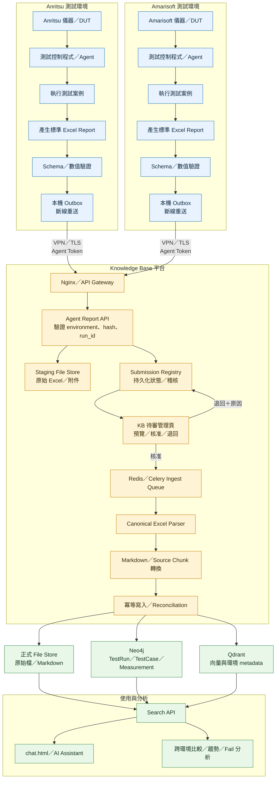

# Anritsu／Amarisoft 測試報告整合架構圖

> 兩個測試環境各自獨立，測試完成後以標準 Excel report 透過 HTTPS API 傳入 Knowledge Base；報告經 KB 待審台核准後才正式入庫。



## 審核與攝入狀態

```text
received → validating → pending_review → approved → queued
                                      └──── rejected

queued → parsing → converting → writing_neo4j → writing_qdrant
       → refreshing_index → completed
       └──────────────────────────────────────→ ingest_failed
```

## 關鍵系統邊界

- Anritsu／Amarisoft 不直接連線 Neo4j、Qdrant、Redis 或 KB 主機檔案系統。
- 核准前只保存於 staging；核准後才進入正式知識庫索引。
- `environment` 固定為 `anritsu` 或 `amarisoft`；`run_id + environment` 用於冪等與衝突檢查。
- Neo4j 保存可精確比較的測試結構與數值；Qdrant 保存報告文字、來源 chunk 與篩選 metadata。
