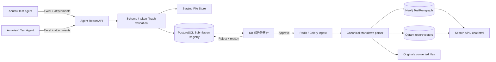

# Anritsu／Amarisoft 測試報告整合

## 資料流



報告上傳後只會進入 staging 與 PostgreSQL；Reviewer 核准前不會寫入正式 Neo4j、Qdrant 或搜尋索引。

## Excel schema v1

檔案必須是 `.xlsx`，`Manifest.schema_version` 固定為 `1.0`，並包含以下工作表：

| Sheet | 必要欄位 |
|---|---|
| `Manifest` | `schema_version`, `run_id`, `environment`, `project_code`, `dut_model`, `started_at`, `finished_at`, `overall_verdict` |
| `RadioConfig` | 可擴充的 `key`, `value`, `unit` |
| `TestCases` | `case_id`, `name`, `status` |
| `Measurements` | `case_id`, `metric`, `value`, `unit`；可加 `lower_limit`, `upper_limit` |
| `Verdicts` | `case_id`, `verdict`, `reason` |
| `RawArtifacts` | `artifact_path`, `sha256` |

`environment` 只能是 `anritsu` 或 `amarisoft`；verdict 只能是 `Pass`、`Fail`、`Error`、`Skipped`。`RawArtifacts` 有資料時，上傳 request 必須帶同名附件且 SHA-256 相符。

## 部署設定

1. 複製 `config/report-ingest.env.example` 的設定到部署環境，不要提交真實 token。
2. Agent 與 Reviewer token 只保存 SHA-256；兩套 Agent 使用不同 token，且 token 綁定 environment。
3. 先以 `./restart_kb.sh --status` 觀察；需要重啟時使用 `./restart_kb.sh --restart --env-file <受控環境檔>`，部署新版則依 `docs/wp01-lifecycle-runbook.md` 執行帶 checkpoint 與 Gate 的 `--deploy`，不得用無驗證的 Compose 指令直接覆蓋正式服務。
4. Reviewer UI 位於 `/admin/report-reviews`，token 只保存在瀏覽器 `sessionStorage`。

正式環境必須使用可信任 CA 或指定 `KB_CA_CERT`，不得停用 TLS 驗證。

## 測試端上傳

測試電腦安裝相同 Python 相依套件與 `scripts/kb_report_uploader.py`，設定：

```bash
export KB_BASE_URL=https://61.216.9.52:3030
export KB_AGENT_ID=anritsu-agent-01
export KB_INGEST_TOKEN='<agent-token>'
export KB_CA_CERT=/path/to/ca.pem
```

操作：

```bash
python3 scripts/kb_report_uploader.py validate report.xlsx
python3 scripts/kb_report_uploader.py send report.xlsx --attachment iperf.json
python3 scripts/kb_report_uploader.py status report_20260723_010203_ab12cd34
python3 scripts/kb_report_uploader.py retry
```

網路錯誤、timeout 或 5xx 會把報告保存在本機 SQLite outbox；schema、token、environment、run ID conflict 等 4xx 不會盲目重試。

## API

- `GET /api/agent/v1/health`
- `POST /api/agent/v1/reports`
- `GET /api/agent/v1/reports/{submission_id}`
- `GET /api/admin/v1/report-submissions`
- `GET /api/admin/v1/report-submissions/{submission_id}`
- `GET /api/admin/v1/report-submissions/{submission_id}/download`
- `POST /api/admin/v1/report-submissions/{submission_id}/approve`
- `POST /api/admin/v1/report-submissions/{submission_id}/reject`

相同 `environment + run_id + report hash` 回傳既有 submission；相同 run、不同 hash 回 `409 run_id_conflict`。

`POST /search` 可帶 filters：

```json
{
  "query": "比較 TCP DL throughput",
  "mode": "auto",
  "filters": {
    "environment": ["anritsu", "amarisoft"],
    "project_code": "NCQ2200B2V",
    "verdict": "pass",
    "date_from": "2026-07-01T00:00:00+08:00",
    "date_to": "2026-07-31T23:59:59+08:00"
  }
}
```

有 filters 時查詢固定走 Qdrant server-side filtering；未帶 filters 時維持既有 auto、hybrid 與 report_graph 路由。
